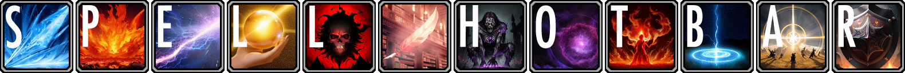
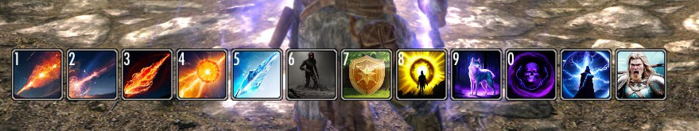
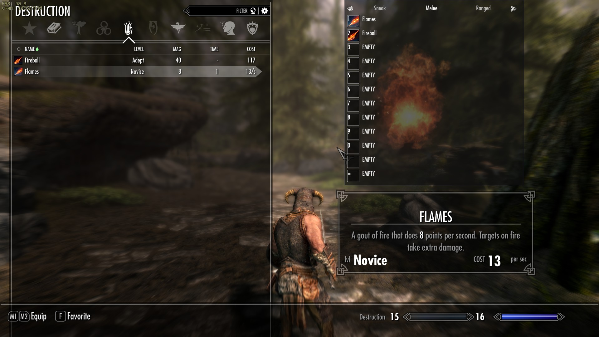

  
# 
Adds a Spell Hotbar to skyrim
  
[Demo Video 1](https://www.youtube.com/watch?v=qC0AHQCgk8A)  
[Demo Video 2](https://www.youtube.com/watch?v=r-Z7taHRuek)  

## Supported Skyrim Version
The mod is built with CommonLib-NG is verified to work on 1.5.97 and 1.6.640   
1.6.1070 should also work, but only quick testing was done.

## Beta State
This mod is currently just released to the public and not well tested. Use at your own risk. Tester Feedback would be greatly appreciated.
SpellHotbar adds two quest scripts (the MCM menu and the script for key input handling and cast events).
Both should be able to get rid of from your save by using [ReSaver](https://www.nexusmods.com/skyrimspecialedition/mods/5031/?tab=files), but no guarantees, still use at or own risk.

## Requirements
[SKSE](https://skse.silverlock.org/)  
[Address Library for SKSE Plugins](https://www.nexusmods.com/skyrimspecialedition/mods/32444)  
[SkyUI](https://www.nexusmods.com/skyrimspecialedition/mods/12604)  
[Jcontainers](https://www.nexusmods.com/skyrimspecialedition/mods/16495)  
[PapyrusUtil](https://www.nexusmods.com/skyrimspecialedition/mods/13048)  
[powerofthree's Papyrus Extender](https://www.nexusmods.com/skyrimspecialedition/mods/22854)  
[DAR](https://www.nexusmods.com/skyrimspecialedition/mods/33746) or [OAR](https://www.nexusmods.com/skyrimspecialedition/mods/92109) - for animations  
[Inventory Interface Information Injector](https://www.nexusmods.com/skyrimspecialedition/mods/85702) - if you want icons in the swf menu

## Slotting Spells
Up to 12 shortcuts can be defined for spells to be directly cast (with weapons in hands) by script.
The slots can be assigned from within the magic menu by hovering over a spell and pressing their shortcut.
Spells, Powers and Shouts are supported.

## Multiple Bars
There are multible different bars available with inheritance that automatically change depending on your equipped items.
e.G: "Two-Handed" bar inherits from "Melee" which inherits from "Default". Inheritance can be disabled for individual bars

### Bars Structure
* Default
  * Melee
    * Dual Wield
    * 1H + Shield
    * Dual Wield
  * 1H + Spell
  * Magic
  * Ranged
  * Sneak
    * Melee Sneak
      * Dual Wield Sneak
      * 1H + Shield Sneak
      * Dual Wield Sneak
    * 1H + Spell Sneak 
    * Magic Sneak
    * Ranged Sneak
* Vampire Lord
* Werewolf (no use without mods)

Every bar except Default, Vampire Lord and Werewolf can be individually disabled, in that case the parent is used.
Just one "Default" bar is possible as minimal setup
  
## Modifiers
Bars can have ctrl, shift and alt modifiers for up to 3 different modes per bar.

## Highly Configurable
Many things like positioning, size, amount of buttons (1-12), keybinds, modifiers (ctrl, shift, alt), disabling individual bars

## Import / Export
MCM config and slotted spells can be individually exported and imported from/to json.

## Individual Spell config
Every spell can be individually configured (casttime, cooldown, icon, animation, ...). Spells without config are also supported, there are default icons and cast data is read from the form
the individual config is only needed for specific spells, like the Master spells (reduce way to long casttime which causes problems with animations, but add cooldonw instead)

### Support for modded spells
All icons and data are defined in .csv files which are read from dedicated folders, any modded skills can be added that way.
There are default icons that will be used for unknown spells, these depend on school, rank and type of a spell. Destruction can check element, Restoration and Illusion if friendly or hostile, Conjuration if summon or bound weapon.  
  
A few spell mods already have icon packs, If you want to add more or help in assisting to create icons for popular spell mods, feel free to contact me.

## AI generated Icons for Spells
All AE content is supported with an icon and spell config

## Animations
Thanks to open permissions from [BOTuser998's Thu'um - Fully Animated Shouts](https://www.nexusmods.com/skyrimspecialedition/mods/50559), these shout animations
can be played when script casting one of the spells. The anim for each spell can be configured in the .csv files.
This requires to have [DAR](https://www.nexusmods.com/skyrimspecialedition/mods/33746) or [OAR](https://www.nexusmods.com/skyrimspecialedition/mods/92109) installed. OAR is more modern and preferable.

# License
The projects consists of different parts
* [SpellHobar.dll](skse_plugin/src) - c++ SKSE plugin, MIT License
* [Python scripts](python_scripts) - utility for stitching textures and more, do whatever you want with them. If a License is needed for legal reasons: MIT License
* [SWF_Generator](/SWF_Generator), java, based on code and libraries from [JPEXS Free Flash Decompiler](https://github.com/jindrapetrik/jpexs-decompiler)  
The java source code in this repo will inherit the GPL v3 License from JPEXS, for detailed licenses of all libs see the JPEXS Free Flash Decompiler project

# Credits
[Mrowpurr](https://github.com/mrowrpurr) for Tutorials & Templates  

## SKSE
[CommonLibSSE-NG](https://github.com/CharmedBaryon/CommonLibSSE-NG)  
[Dear ImGui](https://github.com/ocornut/imgui)  
[RapidCSV](https://github.com/d99kris/rapidcsv)  
[RapidJSON](https://rapidjson.org/)   
[spdlog](https://github.com/gabime/spdlog)  
[stb_image](https://github.com/nothings/stb)  
[SKSE](https://skse.silverlock.org/)  
[Address Library](https://www.nexusmods.com/skyrimspecialedition/mods/32444)  

### Important References
[Wheeler](https://github.com/D7ry/wheeler)  
[LamasTinyHUD](https://github.com/mlthelama/LamasTinyHUD)  
[Immersive Equipment Displays](https://github.com/SlavicPotato/ied-dev)  

## Papyrus / esp
[Cast Spells As Lesser Powers - Oblivion-like Spell Casting](https://www.nexusmods.com/skyrimspecialedition/mods/65398), big inspiration to create Spell Hotbar   
[Thu'um - Fully Animated Shouts](https://www.nexusmods.com/skyrimspecialedition/mods/50559), big thanks for open permission shout anims  
[Jcontainers](https://www.nexusmods.com/skyrimspecialedition/mods/16495)  
[PapyrusUtil](https://www.nexusmods.com/skyrimspecialedition/mods/13048)  
[powerofthree's Papyrus Extender](https://www.nexusmods.com/skyrimspecialedition/mods/22854)  
[SkyUI](https://www.nexusmods.com/skyrimspecialedition/mods/12604)  

## Tools
[SWF Tools](http://www.swftools.org/) - png2swf.exe
